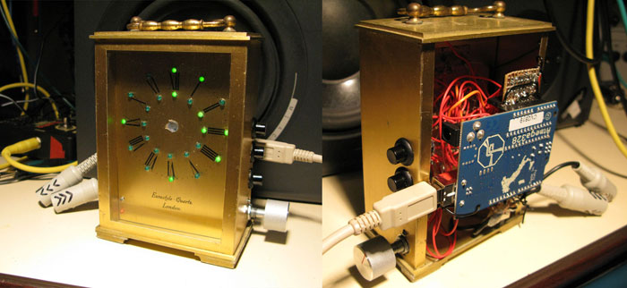
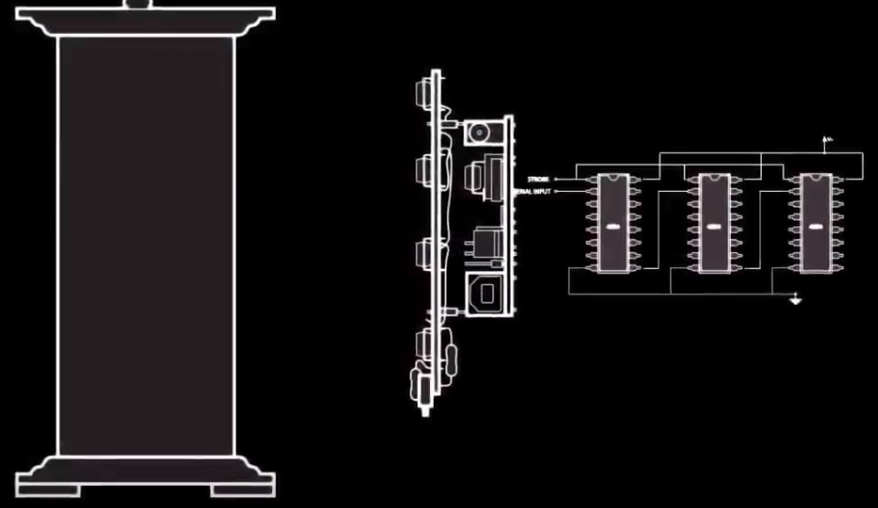

### Harmonic Clock
HACL is a DIY project, where 12, 24 (etc) LEDs are mounted into a surface of an analog clock, and are used to signal incoming MIDI Signals

The firmware defaults to listening on all MIDI channels, but there is a simple interface option provided, consiting with a potentiometer and three buttons, which enables preview only some channels. An alternative mode which unfolds two octaves (To differntiate between alternate octaves)

Created in 2010, First presented on London Music Hackspace meeting in 2011

[http://musichackspace.org/arduino-based-harmonic-clock-project/](http://musichackspace.org/arduino-based-harmonic-clock-project/)

Hardware consits of a standard Arduino MIDI input, and a set of basic serial shift registers to drive the LEDs (Simplified schematic below, and in the video)

Introduction video (Youtube):

[https://www.youtube.com/watch?v=eOKvnIQ3gmY](https://www.youtube.com/watch?v=eOKvnIQ3gmY)

Usage Demos:

[https://www.youtube.com/watch?v=_Yh4oojIDO4](https://www.youtube.com/watch?v=_Yh4oojIDO4)

[https://www.youtube.com/watch?v=DKcpQGguL5g](https://www.youtube.com/watch?v=DKcpQGguL5g)

